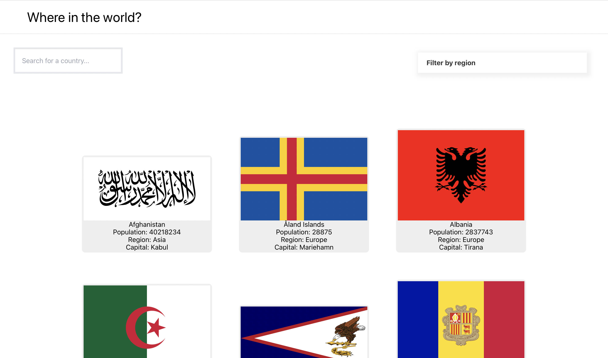

# List of Countries



## What is this app?

This App displays a list of countries from an API ([RESTCountries API](https://restcountries.com/)) and user are able to filter the list using SearchBox and by filtering the countries by region.


## Features

What this app is capable:

- See all countries from the [API](https://restcountries.com/) on the ho
- Search up for a country using the searchbox `input` field
- Filter countries by region or none
- Click on a country to see more detailed information on a separate page
- Click through to the border countries on the detail page
<!-- - Toggle the color scheme between light and dark mode *(optional)* -->


## Live Preview

Click the link below for a quick preview of the app:\
https://unruffled-swartz-d08cf3.netlify.app/


## Technologies and Tools

- Semantic HTML5 markup
- CSS custom properties
- CSS Grid
- [React](https://reactjs.org/) - JS library
- [Tailwind CSS](https://tailwindcss.com) - For styles


## Author

This App is made with passion from scratch by Daniel Ginting (me):
<!-- - Website - [Add your name here](https://www.your-site.com) -->
- Github - [@daniel-ginting](https://github.com/daniel-ginting)
- LinkedIn - [Daniel Ginting](https://www.linkedin.com/in/daniel-ginting-409813224/)
- Discord - [DanielGinting#0651](https://discordapp.com/users/796539553761984565)

Styling with the help of Dat Truong:
- Github = [@dat.truong](https://github.com/dat-truong196nt)
- LinkedIn - [Dat Truong](https://www.linkedin.com/in/truongquocdat196nt)

## Run App Local
If you are interested on cloning this repo:
1. Clone this repo to your local machine
2. From the command-line, run
```bash
npm install
``` 

3. After the packages have been installed, start the live preview
```bash
npm start
```

## Feedback

This app is fairly new and may contain some bugs, don't hesitate to inform me about them.

You can also countribute or give feedback on this project.

Reach me on discord:\
https://discordapp.com/users/796539553761984565

God Bless You! 😇
