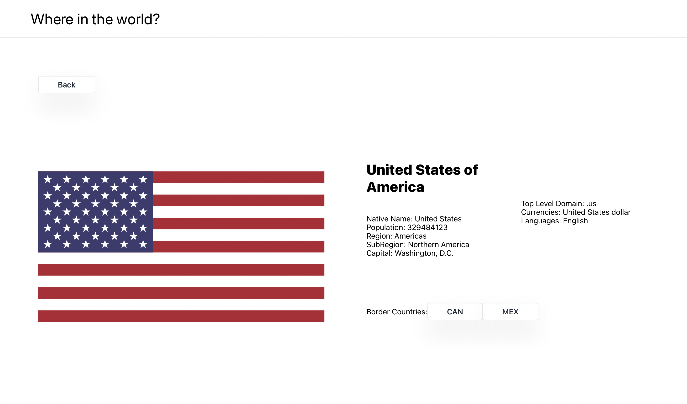

# Frontend Mentor - REST Countries API with color theme switcher solution

This is a solution to the [REST Countries API with color theme switcher challenge on Frontend Mentor](https://www.frontendmentor.io/challenges/rest-countries-api-with-color-theme-switcher-5cacc469fec04111f7b848ca). 

## Table of contents

- [Overview](#overview)
  - [Features](#features)
  - [Screenshot](#screenshot)
  - [Links](#links)
- [My process](#my-process)
  - [Built with](#built-with)
- [Author](#author)

## Overview

### Features

Users should be able to:

- See all countries from the API on the homepage
- Search for a country using an `input` field
- Filter countries by region
- Click on a country to see more detailed information on a separate page
- Click through to the border countries on the detail page
<!-- - Toggle the color scheme between light and dark mode *(optional)* -->

### Screenshot

### Links

- Github Repo: [https://github.com/daniel-ginting/countries](https://github.com/daniel-ginting/countries)
- Live Site URL: [https://daniel-ginting-countries-list.herokuapp.com](https://daniel-ginting-countries-list.herokuapp.com)

## My process

### Built with

- Semantic HTML5 markup
- CSS custom properties
- CSS Grid
- [React](https://reactjs.org/) - JS library
- [Tailwind CSS](https://tailwindcss.com) - For styles

## Author

<!-- - Website - [Add your name here](https://www.your-site.com) -->
- Github - [@daniel-ginting](https://github.com/daniel-ginting)
- LinkedIn - [Daniel Ginting](https://www.linkedin.com/in/daniel-ginting-409813224/)
